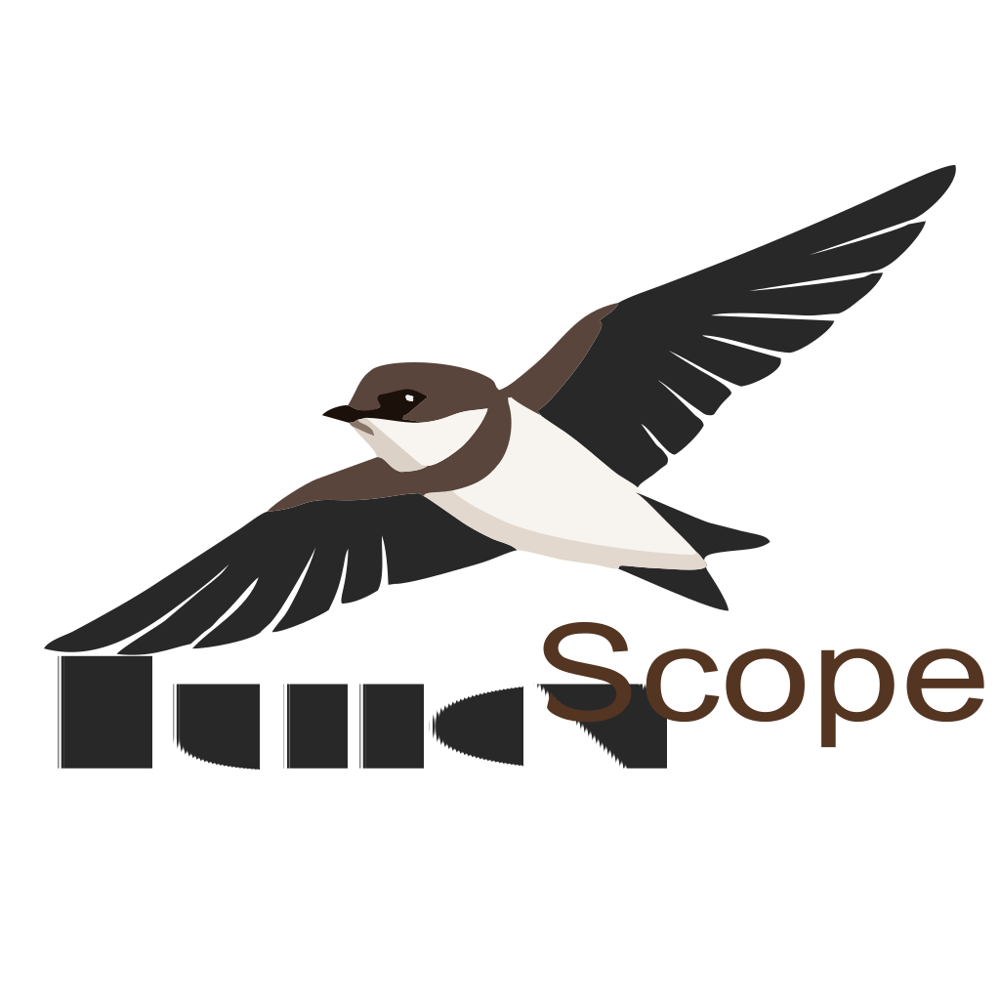
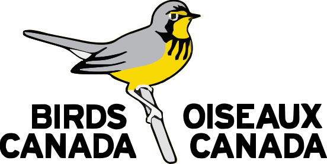
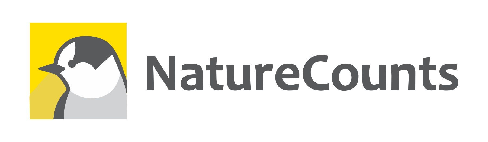
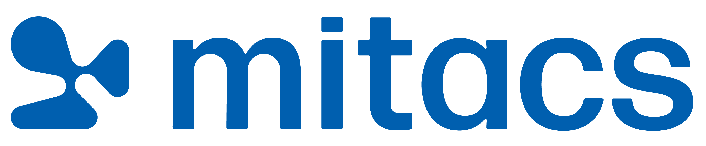

# BurrowScope

**A browser-based workspace for Bank Swallow burrow detection, segmentation, and visual inspection.**

---

## About

BurrowScope is a lightweight web application for inspecting Bank Swallow colony photographs using an ONNX deep learning model. The app detects burrow entrances, displays bounding boxes, masks, centroids, confidence scores, and allows users to export results for review.

The project was developed to support image-based monitoring of Bank Swallow colonies, where colony faces may contain hundreds of burrows and manual counting can be slow and inconsistent.

This version focuses on **per-image burrow detection and segmentation**. It does not yet solve duplicate counting across overlapping photographs. That step requires a later spatial workflow:

**YOLO-seg predictions → boxes and centroids → image registration → shared coordinate system → duplicate merging → unique burrow count**

---

## Main features

- Runs directly in the browser.
- Uses an ONNX segmentation model.
- Detects burrow entrances from uploaded bank-wall images.
- Shows bounding boxes, masks, centroids, labels, and confidence scores.
- Counts detections using post-processed bounding boxes.
- Keeps masks as a visual and quality-control layer.
- Exports results as CSV, JSON, and overlay PNG.
- Includes example images for quick testing.

---

  
  &nbsp;&nbsp;&nbsp;
  
  &nbsp;&nbsp;&nbsp;
  
  &nbsp;&nbsp;&nbsp;
  

---

### Funding by

---